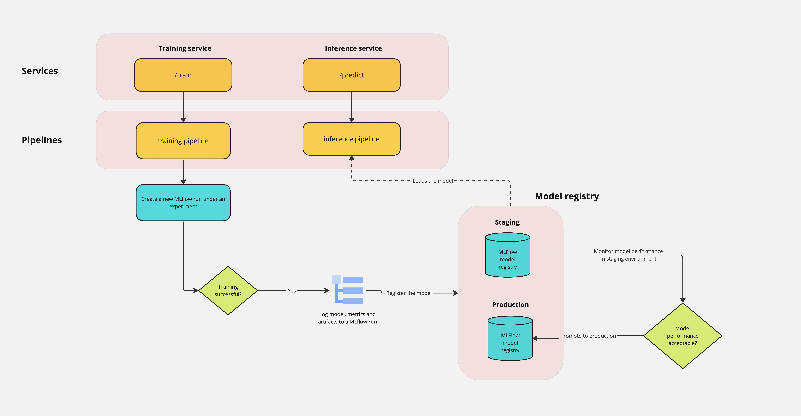

# Retainify

<h2>Goal</h2>

In this project, the goal is to demonstrate all the steps of a typical ML workflow using [Kaggle's Telco Customer Churn](https://www.kaggle.com/datasets/blastchar/telco-customer-churn/) dataset.

A typical ML workflow comprises of 2 parts namely **experimentation** and **deployment** - 

<h3>Experimentation</h3>

1. EDA (Exploratory Data Analysis)
2. Data processing
    - Data cleaning
    - Outlier detection
    - Interpolation
    - Feature reduction/derivation
3. Choose the right metrics that are suitable for the problem in hand as well as relate to business metrics.
4. Explore different models
    - train each model on the train dataset
    - validate on validation dataset or perform cross validation
5. Evaluate on test dataset (hold out dataset)
6. Hyperparameter optimization

<h3>Deployment</h3>

1. Serve the model by creating an endpoint
2. Deploy the training so that rapid retraining of the model is possible.
3. Incorporate CI/CD so that deployments are automatic.

<h2>Architecture diagram</h2>




<h2>Setup</h2>

After cloning this repo, navigate to project folder by running 

```bash
cd retainify
```
0. Create a Python virtual env (optional but recommended) to avoid messing up your other projects dependencies.

```bash
python -m venv venv   # create a new environment called venv
source venv/bin/activate # activate the environment
```

1. Install dependencies
```bash
pip install -r requirements.txt
```

2. Run training services

```bash
uvicorn services.training_service:app --port 8080
```

3. Run inference services

```bash
uvicorn services.inference_service:app --port 8000
```

4. Open MLFlow UI

```bash
mlflow ui
```

<h2>Next Steps</h2>

1. Incorporate Airflow / Kubeflow to build and manage the pipeline.
2. Implement the workflow on deploying a new training pipeline
3. Setup this complete architecture in cloud
